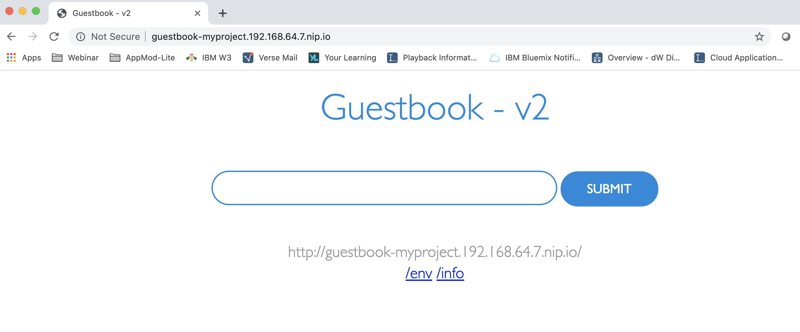

# Deploy the Guestbook Application with the Tone Analyzer

In this section, you will create the guestbook application. The application consists of a web front end, Redis master for storage, and replicated set of Redis slaves, all for which there are Kubernetes replication controllers, pods, and services. The `v2` version of the guestbook application accesses a service in a separate Kubernetes pod through a REST API endpoint to perform a tone analysis of the guestbook entries. This microservice uses the Watson Tone Analyzer service on IBM Cloud.

In a multiple tier application, there are two primary ways that service dependencies can be resolved. The [`v2/guestbook/main.go`](../v2/guestbook/main.go) code provides examples of each. For Redis, the master endpoint is discovered through environment variables. These environment variables are set when the Redis services are started, so the service resources need to be created before the guestbook replication controller starts the guestbook pods. For the analyzer service, an http request is made to a hostname, which allows for resource discovery at the time when the request is made. Consequently, we'll follow a specific order when creating the application components. First up, the Redis components will be created, then the guestbook application, and finally the analyzer microservice.

## Deployment steps

* [Prerequisites](#prerequisites)
* [Create the Redis master pod](#create-the-redis-master-pod)
* [Create the Redis master service](#create-the-redis-master-service)
* [Create the Redis slave pods](#create-the-redis-slave-pods)
* [Create the Redis slave service](#create-the-redis-slave-service)
* [Create the guestbook pods](#create-the-guestbook-pods)
* [Create and expose the guestbook service](#create-and-expose-the-guestbook-service)
* [Create the Analyzer pod](#create-the-analyzer-pod)
* [Create the Analyzer service](#create-the-analyzer-service)
* [View the guestbook](#view-the-guestbook)
* [Cleanup](#cleanup)

### Prerequisites

Continue using the `developer` user and the same project used for creating the Tone Analyzer service instance with the IBM Cloud operator. Note, most of these commands to create resources could be run with either the `kubectl` or `oc` cli. Change to the `v2` folder where the deployment files reside:

```text
cd v2
```

### Create the Redis master pod

Use the `redis-master-deployment.yaml` file to create a [replication controller](https://kubernetes.io/docs/concepts/workloads/controllers/replicationcontroller/) and Redis master [pod](https://kubernetes.io/docs/concepts/workloads/pods/pod-overview/). The pod runs a Redis key-value server in a container. Using a replication controller is the preferred way to launch long-running pods, even for 1 replica, so that the pod benefits from the self-healing mechanism in Kubernetes (keeps the pods alive).

1. Use the [redis-master-deployment.yaml](../v2/redis-master-deployment.yaml) file to create the Redis master deployment in your Kubernetes cluster by running the `oc create -f` *`filename`* command:

    ```console
    $ oc create -f redis-master-deployment.yaml
    deployment.apps "redis-master" created
    ```

2. To verify that the redis-master controller is up, list the deployment and replicaset you created in the cluster with the `oc get` command (if you don't specify a `--namespace`, the current project/namespace will be used.:

    ```console
    $ oc get deploy
    NAME           DESIRED   CURRENT   UP-TO-DATE   AVAILABLE   AGE
    redis-master   1         1         1            1           10m

    $ oc get replicaset
    NAME                      DESIRED   CURRENT   READY     AGE
    redis-master-6767cf65c7   1         1         1         11m
    ```

    Result: The deployment creates the replicaset, which then creates the single Redis master pod.

3. To verify that the redis-master pod is running, list the pods you created in cluster with the `oc get pods` command:

    ```console
    $ oc get pods
    NAME                        READY     STATUS    RESTARTS   AGE
    redis-master-xx4uv          1/1       Running   0          1m
    ...
    ```

    Result: You'll see a single Redis master pod and the machine where the pod is running after the pod gets placed (may take up to thirty seconds).

### Create the Redis master service

A Kubernetes [service](https://kubernetes.io/docs/concepts/services-networking/service/) is a named load balancer that proxies traffic to one or more pods. The services in a Kubernetes cluster are discoverable inside other pods via environment variables or DNS.

Services find the pods to load balance based on pod labels. The pod that you created in previous step has the label `app=redis` and `role=master`. The selector field of the service determines which pods will receive the traffic sent to the service.

1. Use the [redis-master-service.yaml](../v2/redis-master-service.yaml) file to create the service in your Kubernetes cluster by running the `oc create -f` *`filename`* command:

    ```console
    $ oc create -f redis-master-service.yaml
    services/redis-master
    ```

2. To verify that the redis-master service is up, list the services you created in the cluster with the `oc get services` command:

    ```console
    $ oc get services
    NAME              CLUSTER_IP       EXTERNAL_IP       PORT(S)       AGE
    redis-master      10.0.136.3       <none>            6379/TCP      1h
    ...
    ```

    Result: All new pods will see the `redis-master` service running on the host (`$REDIS_MASTER_SERVICE_HOST` environment variable) at port `6379`, or running on `redis-master:6379`. After the service is created, the service proxy on each node is configured to set up a proxy on the specified port (in our example, that's port `6379`).

### Create the Redis slave pods

The Redis master we created earlier is a single pod (REPLICAS = 1), while the Redis read slaves we are creating here are 'replicated' pods. In Kubernetes, a replication controller is responsible for managing the multiple instances of a replicated pod.

1. Use the file [redis-slave-deployment.yaml](../v2/redis-slave-deployment.yaml) to create the replication controller by running the `oc create -f` *`filename`* command:

    ```console
    $ oc create -f redis-slave-deployment.yaml
    deployment.apps "redis-slave" created
    ```

2. To verify that the redis-slave controller is running, run the `oc get rs` command:

    ```console
    $ oc get deploy
    NAME           DESIRED   CURRENT   UP-TO-DATE   AVAILABLE   AGE
    redis-master   1         1         1            1           23m
    redis-slave    2         2         2            0           15s

    $ oc get rs
    NAME                      DESIRED   CURRENT   READY     AGE
    redis-master-6767cf65c7   1         1         1         23m
    redis-slave-564b7bd5d9    2         2         2         30s

    ```

    Result: The deployment creates the replicaset, which then creates configures the Redis slave pods through the redis-master service (name:port pair, in our example that's `redis-master:6379`).

    Example:
    The Redis slaves get started by the deployment/replicaset with the following command:

    ```console
    redis-server --slaveof redis-master 6379
    ```

3. To verify that the Redis master and slaves pods are running, run the `oc get pods` command:

    ```console
    $ oc get pods
    NAME                          READY     STATUS    RESTARTS   AGE
    redis-master-xx4uv            1/1       Running   0          25m
    redis-slave-b6wj4             1/1       Running   0          1m
    redis-slave-iai40             1/1       Running   0          1m
    ...
    ```

    Result: You see the single Redis master and two Redis slave pods.

### Create the Redis slave service

Just like the master, we want to have a service to proxy connections to the read slaves. In this case, in addition to discovery, the Redis slave service provides transparent load balancing to clients.

1. Use the [redis-slave-service.yaml](../v2/redis-slave-service.yaml) file to create the Redis slave service by running the `oc create -f` *`filename`* command:

    ```console
    $ oc create -f redis-slave-service.yaml
    service "redis-slave" created
    ```

2. To verify that the redis-slave service is up, list the services you created in the cluster with the `oc get services` command:

    ```console
    $ oc get services
    NAME              CLUSTER_IP       EXTERNAL_IP       PORT(S)       AGE
    redis-master      10.0.136.3       <none>            6379/TCP      1h
    redis-slave       10.0.21.92       <none>            6379/TCP      1h
    ...
    ```

    Result: The service is created and accessible at `redis-slave:6379` by pods running in the project

### Create the guestbook pods

This is a simple Go `net/http` ([negroni](https://github.com/codegangsta/negroni) based) server that is configured to talk to either the slave or master services depending on whether the request is a read or a write. The pods we are creating expose a simple JSON interface and serves a jQuery-Ajax based UI. Like the Redis read slaves, these pods are also managed by a replication controller.

1. Use the [guestbook-deployment.yaml](../v2/guestbook-deployment.yaml) file to create the guestbook replication controller by running the `oc create -f` *`filename`* command:

    ```console
    $ oc create -f guestbook-deployment.yaml
    deployment.apps "guestbook" created
    ```

   Tip: If you want to modify the guestbook code it can be found in the `guestbook` directory, along with its Makefile. If you have pushed your custom image be sure to update the `image` property accordingly in the guestbook-deployment.yaml.

2. To verify that the guestbook deployment is running, run the `oc get deploy` command:

    ```console
    $ oc get deploy
    NAME           DESIRED   CURRENT   UP-TO-DATE   AVAILABLE   AGE
    guestbook-v2   3         3         3            3           38s
    redis-master   1         1         1            1           27m
    redis-slave    2         2         2            2           14m
    ```

3. To verify that the guestbook pods are running (it might take up to thirty seconds to create the pods), list the pods you created in cluster with the `oc get pods` command:

    ```console
    $ oc get pods
    NAME                           READY     STATUS    RESTARTS   AGE
    guestbook-3crgn                1/1       Running   0          2m
    guestbook-gv7i6                1/1       Running   0          2m
    guestbook-x405a                1/1       Running   0          2m
    redis-master-xx4uv             1/1       Running   0          23m
    redis-slave-b6wj4              1/1       Running   0          6m
    redis-slave-iai40              1/1       Running   0          6m
    ...
    ```

    Result: You see a single Redis master, two Redis slaves, and three guestbook pods.

### Create and expose the guestbook service

Just like the others, we create a service to group the guestbook pods. Since guestbook uses a web application protocol we will expose it for access outside the cluster using an OpenShift Route.

1. Use the [guestbook-service.yaml](../v2/guestbook-service.yaml) file to create the guestbook service by running the `oc create -f` *`filename`* command:

    ```text
    oc create -f guestbook-service.yaml
    ```

2. To verify that the guestbook service is up, list the services you created in the cluster with the `oc get services` command:

    ```console
    $ oc get services
    NAME              CLUSTER_IP       EXTERNAL_IP       PORT(S)       AGE
    guestbook         10.0.217.218     <none>            80/TCP        1h
    redis-master      10.0.136.3       <none>            6379/TCP      1h
    redis-slave       10.0.21.92       <none>            6379/TCP      1h
    ...
    ```

    Result: The service is created, but not yet accessible outside of the cluster

3. Use the `oc expose` command to configure a route to access the application

    ```text
    $ oc expose service guestbook
    route.route.openshift.io/guestbook exposed
    ```

4. To verify that the guestbook route is active list the current routes with the `oc get routes` command:

    ```console
    $ oc get routes
    NAME        HOST/PORT                                 PATH      SERVICES    PORT      TERMINATION   WILDCARD
    guestbook   guestbook-myproject.192.168.64.7.nip.io             guestbook   http                    None
    ```

    Result: The default URL for accessing the application uses the service name followed by the project and then the base domain for the OpenShift cluster.

### Create the analyzer pod

This is a simple PHP Flask application that creates a POST endpoint `/tone` and takes the input text and sends it to the Watson Tone Analyzer service. In the [analyzer-deployment.yaml](../v2/analyzer-deployment.yaml) the spec for the pod defines environment variables for the service credentials by reading the secret `binding-tone` created by the IBM Cloud operator.

1. Use the [analyzer-deployment.yaml](../v2/analyzer-deployment.yaml) file to create the analyzer replication controller by running the `oc create -f` *`filename`* command:

    ```console
    $ oc create -f analyzer-deployment.yaml
    deployment.apps "analyzer" created
    ```

   Tip: If you want to modify the analyzer code it can be found in the `analyzer` directory, along with its Makefile. If you have pushed your custom image be sure to update the `image` property accordingly in the analyzer-deployment.yaml.

2. To verify that the guestbook deployment is running, run the `oc get deploy` command:

    ```console
    $ oc get deploy
    NAME           DESIRED   CURRENT   UP-TO-DATE   AVAILABLE   AGE
    analyzer       1         1         1            1           40s
    guestbook-v2   3         3         3            3           5m
    redis-master   1         1         1            1           27m
    redis-slave    2         2         2            2           14m
    ```

### Create the analyzer service

Create a service so that the guestbook application can call the analyzer pod

1. Use the [analyzer-service.yaml](../v2/analyzer-service.yaml) file to create the analyzer service by running the `oc create -f` *`filename`* command:

    ```text
    oc create -f analyzer-service.yaml
    ```

2. To verify that the analyzer service is up, list the services you created in the cluster with the `oc get services` command:

    ```console
    $ oc get services
    NAME              CLUSTER_IP       EXTERNAL_IP       PORT(S)       AGE
    analyzer          10.0.210.45      <none>            80/TCP        1h
    guestbook         10.0.217.218     <none>            80/TCP        1h
    redis-master      10.0.136.3       <none>            6379/TCP      1h
    redis-slave       10.0.21.92       <none>            6379/TCP      1h
    ...
    ```

    Result: The service is created

### View the guestbook

You can now play with the guestbook that you just created by opening it in a browser, use the URL provided by the `oc get routes` command.

Result: The guestbook displays in your browser:



### Cleanup

After you're done playing with the guestbook, you can cleanup by deleting the guestbook service and removing the associated resources that were created, including routes, forwarding rules, target pools, and Kubernetes replication controllers and services.

Delete all the resources sourced by the files in the `v2` directory by running the following `oc delete -f .` command:

```console
$ oc delete -f .
deployment.apps "analyzer" deleted
service "analyzer" deleted
deployment.apps "guestbook-v2" deleted
service "guestbook" deleted
deployment.apps "redis-master" deleted
service "redis-master" deleted
deployment.apps "redis-slave" deleted
service "redis-slave" deleted
```

Delete the route created for the guestbook application:

```console
$ oc delete route guestbook
route.route.openshift.io "guestbook" deleted
```
