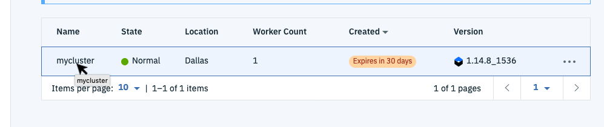
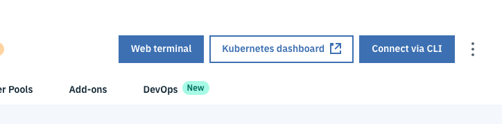
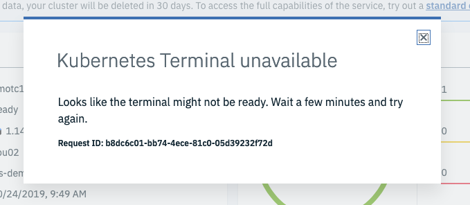
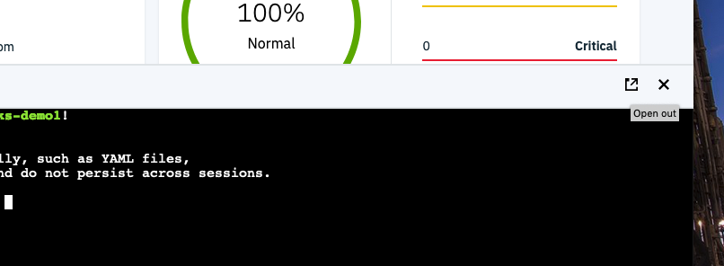

# Lab setup - web terminal and resources

You will already need an IBM Cloud account and an IBM Kubernetes Service cluster (free or paid) in order to proceed.

## Set up the web terminal

1. Log in to the [IBM Cloud](https://cloud.ibm.com) to the dashboard
2. Click on the top left navigation menu and select **Kubernetes**

    

3. Open the control panel for your cluster by clicking on the name

    

4. Click on the **Web terminal** button

    

5. Click on the **Install** button if prompted (this won't be shown if the terminal is already installed). Getting the terminal ready will take a couple of minutes. If you click on the **Web terminal** button before it's ready you will see

    

6. Open the web terminal - it will initially display at the bottom of the browser panel. Click on the expand button to open the terminal in a full browser tab:

    

7. Run the `ibmcloud ks clusters` command to verify the terminal and setup for access to the cluster:

    

8. Configure the `kubectl` cli available within the terminal for access to your cluster and verify access to the Kubernetes API

    ```bash
    $ eval $(ibmcloud ks cluster-config --cluster mycluster --export)
    $ kubectl get namespace
    NAME              STATUS   AGE
    default           Active   125m
    ibm-cert-store    Active   121m
    ibm-system        Active   124m
    kube-node-lease   Active   125m
    kube-public       Active   125m
    kube-system       Active   125m
    ```

    If your output looks like that - you're good to go with the rest of the lab exercises.

## 