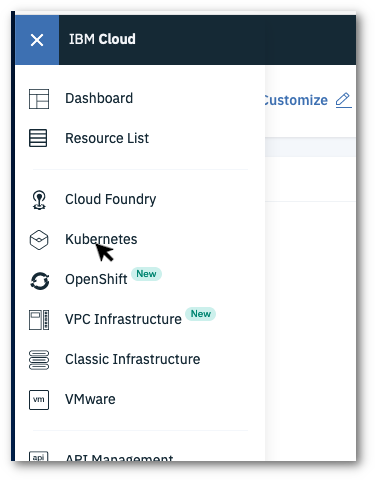

# Kubernetes Cluster setup

In this module, you will create an IBM Cloud account (if you do not already have an account) and create an IBM Kubernetes Service (IKS)cluster instance. Creating the IKS cluster will take approximately 20 minutes, so plan for this brief delay before going on to complete the rest of the lab exercises.

Begin with the appropriate step for you, if you don't already have an IBM Cloud account, start with that. Otherwise begin at log in to IBM Cloud and create your cluster.

* [Create an IBM Cloud account](#create-an-ibm-cloud-account)
* [Log in to IBM Cloud and create Kubernetes cluster](#log-in-to-ibm-cloud-and-create-kubernetes-cluster)

## Create an IBM Cloud account

If you do not have an IBM Cloud account go to [IBM Cloud Registration](https://cloud.ibm.com/registration).

Complete all of the fields and then click on the **Create Account** button.

A confirmation email with a link will be sent to you. Open your email application and click on the link to verify your email address and activate your account.

> Note: Activating your account may take you directly to the IBM Cloud dashboard. If this happens, it ok to skip over the login step in the following section.

## Log in to IBM Cloud and create Kubernetes cluster

Log in to the [IBM Cloud](https://cloud.ibm.com) to access the dashboard.

Click on the top left navigation menu and select **Kubernetes**.

In the **Kubernetes Cluster** tile in the middle of the screen, click on the **Create cluster** button.

This will bring you to a page where you can select a cluster plan type.

Select the **Free** plan and then wait to see if you are shown a **Create cluster** button. If you see this, click on the button to create your cluster (keep the default the cluster name of *mycluster*). You're all set when the creating cluster confirmation message appears.

If you see **Upgrade** - you will need to upgrade your IBM Cloud account with a feature code before creating the cluster.

## Applying the IBM Cloud feature code and creating a cluster

Your lab instructor will provide a link (and possibly a confirmation code) to obtain the feature code.

To apply the feature code to your account, click in the top menu **Manage->Account**. Then from the left menu, select **Account Settings** .

Scroll in the main panel to the *Subscription and feature codes* section and click on **Apply code**.

Enter in the feature code and select **Apply**

After the code is applied - Click on the top left navigation menu and select **Kubernetes**.

In the **Kubernetes Cluster** tile in the middle of the screen, click on the **Create cluster** button.

This will bring you to a page where you can select a cluster plan type.

Select the **Free** plan and then wait to see if you are shown a **Create cluster** button. Click on the button to create your cluster (keep the default the cluster name of *mycluster*). You're all set when the creating cluster confirmation message appears.

Continue on to the [next exercise](../exercise-0b/README.md).
