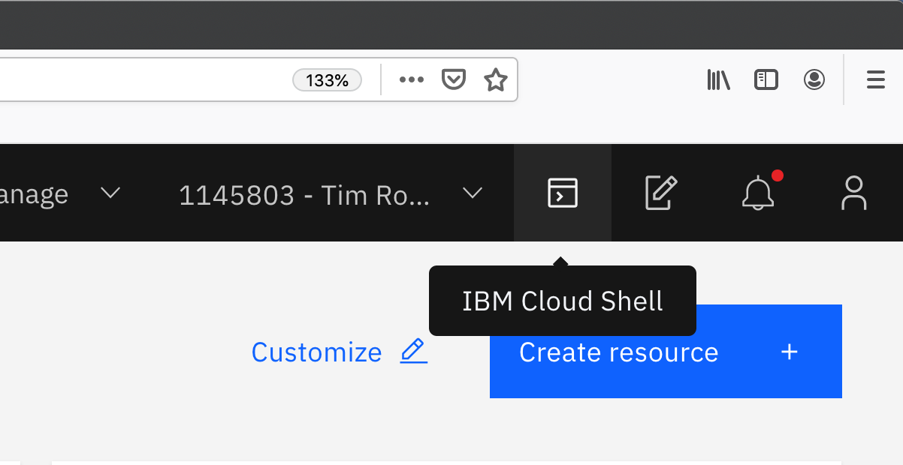

# Lab setup - get web terminal and content

You will already need an IBM Cloud account and an IBM Kubernetes Service cluster (free or paid) in order to proceed. You should have completed this in the previous module.

## Set up the web terminal

Log in to the [IBM Cloud](https://cloud.ibm.com) to access the dashboard.

Click on the top right terminal icon to launch the **IBM Cloud Shell**.



Run the `ibmcloud ks clusters` command to verify the terminal and setup for access to the cluster

```text
ibmcloud ks clusters
```

> it's ok to ignore warnings you may see about versions of plugins or kubernetes cluster versions


Configure the `kubectl` cli available within the terminal for access to your cluster.

```text
ibmcloud ks cluster config --cluster mycluster
```

Verify access to the Kubernetes API.

```text
kubectl get namespace
```

You should see output similar to the following, if so, then your're ready to continue.

```text
NAME              STATUS   AGE
default           Active   125m
ibm-cert-store    Active   121m
ibm-system        Active   124m
kube-node-lease   Active   125m
kube-public       Active   125m
kube-system       Active   125m
```

## Clone the lab repository

In some of the labs, you will be creating Kubernetes resources by applyig `.yaml` files representing the desired state for the resource. To save typing in all of that, clone the lab repository into your web terminal:

```text
git clone https://github.com/timroster/digidevcon-iks
```

you should see:

```text
Cloning into 'digidevcon-iks'...
remote: Enumerating objects: 61, done.
remote: Counting objects: 100% (61/61), done.
remote: Compressing objects: 100% (44/44), done.
remote: Total 61 (delta 13), reused 61 (delta 13), pack-reused 0
Unpacking objects: 100% (61/61), done.
```

Continue on to the [next exercise](../exercise-1/README.md).
