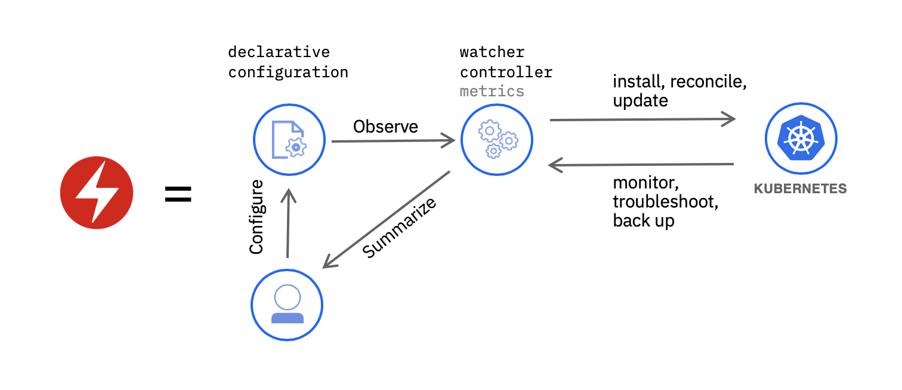

# Installing the IBM Cloud Operator

The Operator Framework provides support for Kubernetes-native extensions to manage custom resource types through operators. Many operators are available through [operatorhub.io](https://operatorhub.io/), including the IBM Cloud operator. The IBM Cloud operator simplifies the creation of IBM Cloud services and resouces and binding credentials from these resources into a Kubernetes cluster. The instructions in this guide are adapted from the IBM Developer tutorial [Simplify the lifecycle management process for your Kubernetes apps with operators](https://developer.ibm.com/tutorials/simplify-lifecycle-management-kubernetes-openshift-ibm-cloud-operator/).

With the IBM Cloud Kubernetes Service clusters at version 1.16 and later, the Operator Framework is already installed. So all you will need to do is install the IBM Cloud Operator. New clusters created after March 1st, 2020 should all be at this level (or later).

## Installing the IBM Cloud operator

1. With the OLM framework and marketplace support installed, it's time to install the IBM Cloud operator. This operator will use an IBM Cloud API key to manage resources within the cluster. Begin to configure the IBM Cloud operator by logging in to the IBM Cloud account using the IBM Cloud CLI. Start by logging in to IBM Cloud

    ```text
    ibmcloud login
    ```

1. Check your login default region to verify that there is a Cloud Foundry organization and space with this command:

    ```text
    ibmcloud account orgs
    ```

    If there is output like:

    ```text
    Getting orgs in region 'us-south' as myemail@example.com ...
    Retrieving current account...
    No organizations were found.
    ```

    Skip forward to the next step. Otherwise, if a Cloud Foundry organization is shown run the command:

    ```text
    ibmcloud target --cf
    ```

1. Verify that the ibmcloud CLI session is configured with a resource group for creation of the Tone Analyzer by the IBM Cloud operator. Run this command:

    ```text
    ibmcloud target
    ```

    Check the output from the `ibmcloud target` command. If there is no resource group set, resulting in a message including:

    `Resource group:    No resource group targeted, use 'ibmcloud target -g RESOURCE_GROUP'`

    then set the target resource group to the `Default` using:

    ```text
    ibmcloud target -g Default
    ```

    > some older IBM Cloud accounts may have a resource group named `default`, if you see an error using `Default`, repeat the command with `default`.

1. Use the provided script to create an API key for the IBM Cloud Operator and add it as a secret to the `default` namespace in the kubernetes cluster:

    ```text
    $HOME/digidevcon-iks/config-ibmcloud-operator.sh
    ```

1. The operator marketplace catalog provides a URL for the resources to install for each operator. Install the IBM Cloud Operator with the following command:

    ```text
    curl -sL https://raw.githubusercontent.com/IBM/cloud-operators/master/hack/configure-operator.sh | bash
    ```

    Check that the pod for the IBM Cloud operator is running with:

    ```text
    kubectl get pods --namespace ibmcloud-operators
    ```

    You should see after a minute or two that the pod for the operator is running:

    ```console
    $ kubectl get pods -n ibmcloud-operators
    NAME                                 READY   STATUS    RESTARTS   AGE
    ibmcloud-operator-76cb79d746-nksq8   1/1     Running   0          8m14s
    ```

## Understanding Operators

The [Operator Pattern](https://kubernetes.io/docs/concepts/extend-kubernetes/operator/) is an emerging approach to extend through automation the expertise of human operators into the cluster environment. Operators are intended to support applications and management of other resources in and related to kubernetes clusters starting at installation, but continuing to day 2 operations of monitoring, backup, fault recovery and, of course, updates.



Operators are custom code that uses the Kubernetes API (as a client) to implement a controller for a [**Custom Resource**](https://kubernetes.io/docs/concepts/extend-kubernetes/api-extension/custom-resources/). Unlike the controllers built into the Kubernetes control plane which run on the Kubernetes master node, operators run outside of the Kubernetes control plan as pods on the worker nodes in the cluster. You can verify that fact by the `kubectl get pods` command above, which lists the pods of the operator running on a worker node.

In addition to the IBM Cloud Operator, there are many operators that can manage resources within your cluster available from the [Operator Hub](https://operatorhub.io). The Operator Hub includes many useful operators including operators that implement database installation, monitoring tools, application development frameworks, application runtimes and more.

Your cluster now has the IBM Cloud operator installed. This operator is able to configure two custom resources in the cluster, a **Service** and a **Binding**. The **Service** defines a specific IBM Cloud service instance type to create, and the **Binding** specifies a named binding of a service instance to a secret in the cluster. For more details about the IBM Cloud operator see the [project repository](https://github.com/IBM/cloud-operators)

Continue by using the IBM Cloud operator to [Create a Tone Analyzer service on IBM Cloud](../exercise-4/README.md)
