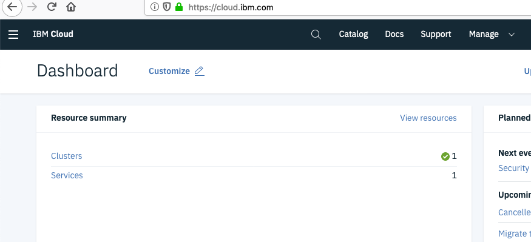
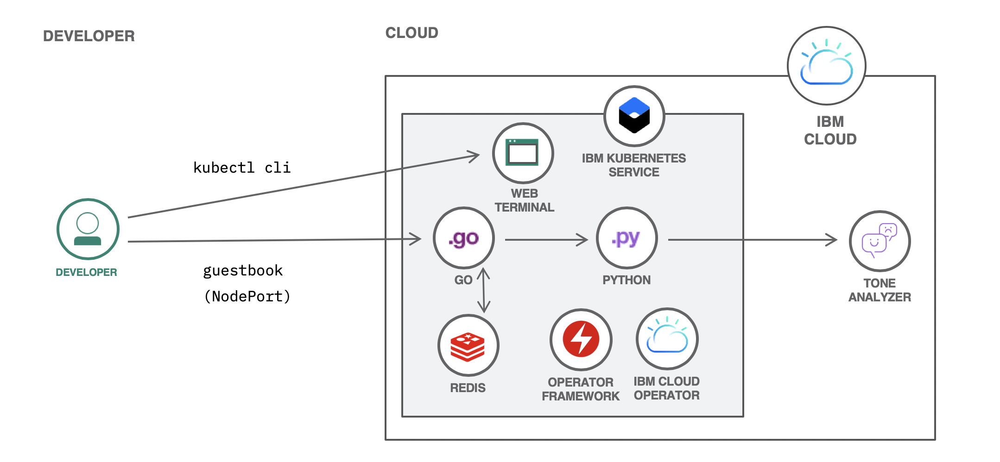

# Creating an instance of Tone Analyzer

For an application running within a Kubernetes cluster to be able to access an IBM Cloud service, the service needs to be created and the credentials to access the service must be added to the cluster so that they can be read by deployed applications. The Kubernetes cluster running the application accessing the service instance can be anywhere, but in this case you'll be using your Kubernetes cluster on IBM Cloud.

## Create the service instance and bind to the cluster

1. Change into the `digidevcon-iks` directory. apply the `tone.yaml` file. This file defines a **Service** and **Binding** resource:

    ```console
    cd $HOME/digidevcon-iks
    ```

1. Apply the `tone.yaml` file using kubectl. This file defines a **Service** and **Binding** resource:

    ```text
    kubectl apply -f tone.yaml
    ```

    This file defines a **Service** and **Binding** resource and if successful there will be confirmation for both:

    ```console
    $ kubectl apply -f tone.yaml
    service.ibmcloud.ibm.com/mytone created
    binding.ibmcloud.ibm.com/binding-tone created
    ```

1. Check for the secret for the Tone Analyzer service instance added to the current namespace:

    ```text
    kubectl get secret binding-tone
    ```

    You should see confirmation of the secret, but there may be a short delay as the credentials are obtained by the operator, so repeat this command until you no longer see an error like: *Error from server (NotFound): secrets "binding-tone" not found*

    ```bash
    $ kubectl get secret binding-tone
    NAME           TYPE      DATA      AGE
    binding-tone   Opaque    6         40s
    ```

    With the credentials added to the current namespace, you will be able to deploy guestbook application that uses the analyzer microservice. But first, let's do a little checking of the actions by the IBM Cloud operator.

## Check the IBM Cloud console - verify the Tone Analyzer serivce

You can return to your IBM Cloud console and see that the tone analyzer service was created as specified in the `tone.yaml` resource file.

1. Go back to your IBM Cloud tab in the browser and click on the words **IBM Cloud** on the upper left of the top menu. Now your Dashboard view will show a Services item under the **Resource summary**

    

1. Click on the label **Services** in the **Resource Summary**, then click on the **mytone** label in the Services list. This will open up the control panel for the IBM Watson Tone Analyzer service.

1. Click on the **Show Credentials** label to see your service API Key - make a note of it or just keep the credentials visible.

1. Return to the *Kubernetes Terminal* tab in your web browser and enter this command to extract and decode the apikey from the secret created by the IBM Cloud Operator:

    ```text
    kubectl get secret binding-tone -o=jsonpath='{.data.apikey}' | base64 -d && echo
    ```

    Notice how the string displayed is exactly the same as the service API Key visible from the control panel for the service.

## Lifecycle management with the IBM Cloud operator

Let's take a look at the custom resource definition (CRD) file that was used in this exercise (`tone.yaml`).

```bash
apiVersion: ibmcloud.ibm.com/v1alpha1
kind: Service
metadata:
  name: mytone
spec:
  plan: lite
  serviceClass: tone-analyzer
---
apiVersion: ibmcloud.ibm.com/v1alpha1
kind: Binding
metadata:
  name: binding-tone
spec:
  serviceName: mytone
  role: Manager
```

Note that the API version is different from what you may have seen in other resource files in this lab. Since Kubernetes objects are scoped by the API, there's no conflict with the re-use of the `kind` **Service** in this CRD. Recall that in the internal Kubernetes API, a resource of `kind` **Service** is used to expose network ports running on pods. Here, the **Service** object type is used to descibe an IBM Cloud platform service from the catalog. The operator uses the `spec` of the resource to select the desired IBM Cloud service type and offering plan.

The role of the IBM Cloud operator is to manage instances of these services and also create a **Binding** to the service that is stored as a secret in the cluster.
The operator will monitor the IBM Cloud account service instances. If something happens to the service instance, the operator will detect the change and take action. For example, if a the service instance is deleted, the operator will create a new service instance and update the credentials stored in the binding secret.

## Continue with deploying the guestbook application

In the last section of the lab, you will use resource files and the `kubectl create` command to create a complex application topology that is very representative of a typical deployment on Kubernetes. This application will have a web front end written in go, it will persist data entered into the application in a redis database and the application will have an analyzer service witten in python that calls the IBM Watson Tone Analyzer service running outside of the Kubernetes cluster.



Continue the exercise by [deploying the guestbook application](../exercise-5/README.md)
