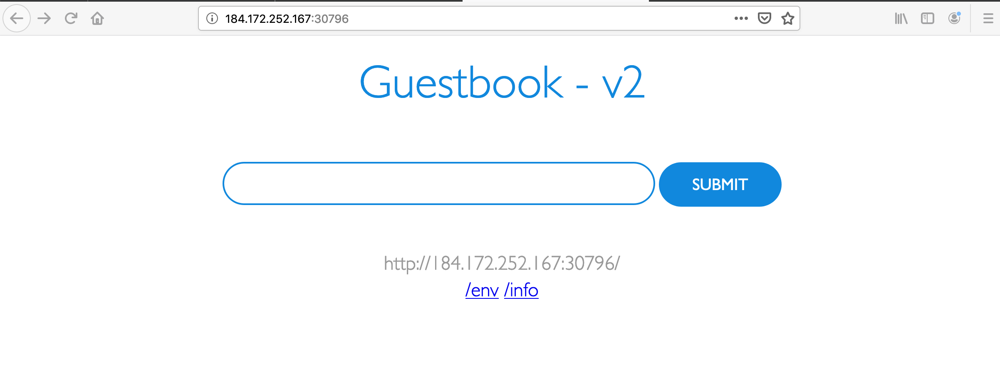

# Deploy the Guestbook Application with the Tone Analyzer

In this section, you will re-create the guestbook application, but this time with more components in a multi-tier architecture. This application uses the `v2` version of the go application we used previously in the workshop as our web front end, and adds on 1) a Redis master for storage, 2) a replicated set of Redis slaves, and 3) a Python Flask application that calls the Watson Tone Analyzer service deployed in IBM Cloud. For all of these components, there are Kubernetes replication controllers, pods, and services. One of the main concerns with building a multi-tier application on Kubernetes, such as this one, is resolving dependencies between all of these seperately deployed components.

In a multiple tier application, there are two primary ways that service dependencies can be resolved. The [`v2/guestbook/main.go`](../../v2/guestbook/main.go) code provides examples of each. For Redis, the master endpoint is discovered through environment variables. These environment variables are set when the Redis services are started, so the service resources need to be created before the guestbook replication controller starts the guestbook pods. For the analyzer service, an http request is made to a hostname, which allows for resource discovery at the time when the request is made. Consequently, we'll follow a specific order when creating the application components. First up, the Redis components will be created, then the guestbook application, and finally the analyzer microservice.

## Setup

Continue by working in the web terminal. Change to the `v2` folder where the deployment files reside:

```text
cd $HOME/digidevcon-iks/v2
```

## Create the Redis master pod

Use the `redis-master-deployment.yaml` file to create a [replication controller](https://kubernetes.io/docs/concepts/workloads/controllers/replicationcontroller/) and Redis master [pod](https://kubernetes.io/docs/concepts/workloads/pods/pod-overview/). The pod runs a Redis key-value server in a container. Using a replication controller is the preferred way to launch long-running pods, even for 1 replica, so that the pod inherits benefits from the self-healing mechanism in Kubernetes (i.e. keeps the pods alive).

1. Use the [redis-master-deployment.yaml](../../v2/redis-master-deployment.yaml) file to create the Redis master deployment in your Kubernetes cluster:

    ```text
    kubectl create -f redis-master-deployment.yaml
    ```

    ```console
    $ kubectl create -f redis-master-deployment.yaml
    deployment.apps/redis-master created
    ```

1. To verify that the redis-master controller is up, list the deployment and replicaset you created in the cluster with the `kubectl get` command (if you don't specify a `--namespace`, the current project/namespace will be used):

    ```text
    kubectl get deploy
    ```

    this will show the current deployments in the namespace

    ```console
    $ kubectl get deploy
    NAME           READY   UP-TO-DATE   AVAILABLE   AGE
    redis-master   1/1     1            1           15s
    ```

    ```text
    kubectl get replicaset
    ```

    this will show the current deployments in the namespace

    ```console
    $ kubectl get replicaset
    NAME                      DESIRED   CURRENT   READY   AGE
    redis-master-7b7968db76   1         1         1       41s
    ```

    Result: The deployment creates the replicaset, which then creates the single Redis master pod.

1. Verify that the redis-master pod is running, by listing the pods you created in cluster:

    ```text
    kubectl get pods
    ```

    ```console
    $ kubectl get pods
    NAME                            READY   STATUS    RESTARTS   AGE
    redis-master-7b7968db76-8mjqg   1/1     Running   0          67s
    ```

    Result: You'll see a single Redis master pod (may take up to thirty seconds).

## Create the Redis master service

A Kubernetes [service](https://kubernetes.io/docs/concepts/services-networking/service/) is a named load balancer that proxies traffic to one or more pods. The services in a Kubernetes cluster are discoverable inside other pods via environment variables or DNS.

Services find the pods to load balance based on pod labels. The pod that you created in previous step has the label `app=redis` and `role=master`. The selector field of the service determines which pods will receive the traffic sent to the service.

1. Use the [redis-master-service.yaml](../../v2/redis-master-service.yaml) file to create the service in your Kubernetes cluster:

    ```text
    kubectl create -f redis-master-service.yaml
    ```

    ```console
    $ kubectl create -f redis-master-service.yaml
    service/redis-master created
    ```

1. To verify that the redis-master service is up, list the services you created in the cluster:

    ```text
    kubectl get services
    ```

    ```console
    $ kubectl get services
    NAME           TYPE        CLUSTER-IP    EXTERNAL-IP   PORT(S)    AGE
    kubernetes     ClusterIP   172.21.0.1    <none>        443/TCP    8h
    redis-master   ClusterIP   172.21.36.3   <none>        6379/TCP   10s
    ...
    ```

    Result: All new pods will see the `redis-master` service running on the host (`$REDIS_MASTER_SERVICE_HOST` environment variable) at port `6379`, or running on `redis-master:6379`. After the service is created, the service proxy on each node is configured to set up a proxy on the specified port (in our example, that's port `6379`).

## Create the Redis slave pods

The Redis master we created earlier is a single pod (REPLICAS = 1), while the Redis read slaves we are creating here are 'replicated' pods with 2 instances that will be started. In Kubernetes, a replication controller is responsible for managing the multiple instances of a replicated pod.

1. Use the file [redis-slave-deployment.yaml](../../v2/redis-slave-deployment.yaml) to create the replication controller:

    ```text
    kubectl create -f redis-slave-deployment.yaml
    ```

    ```console
    $ kubectl create -f redis-slave-deployment.yaml
    deployment.apps/redis-slave created
    ```

1. To verify that the redis-slave controller is running:

    ```text
    kubectl get rs
    ```

    ```console
    $ kubectl get rs
    NAME                      DESIRED   CURRENT   READY   AGE
    redis-master-7b7968db76   1         1         1       2m48s
    redis-slave-6944587c87    2         2         2       36s
    ```

    Result: The deployment creates the replicaset, which then creates configures the Redis slave pods through the redis-master service (name:port pair, in our example that's `redis-master:6379`).

1. Verify that the Redis master and slaves pods are running:

    ```text
    kubectl get pods
    ```

    ```console
    $ kubectl get pods
    NAME                            READY   STATUS    RESTARTS   AGE
    redis-master-7b7968db76-8mjqg   1/1     Running   0          3m25s
    redis-slave-6944587c87-4gvgj    1/1     Running   0          73s
    redis-slave-6944587c87-h66wp    1/1     Running   0          73s
    ...
    ```

    Result: You see the single Redis master and two Redis slave pods.

## Create the Redis slave service

Just like the master, we want to have a service to proxy connections to the read slaves. In this case, in addition to discovery, the Redis slave service provides transparent load balancing to clients.

1. Use the [redis-slave-service.yaml](../../v2/redis-slave-service.yaml) file to create the Redis slave service:

    ```text
    kubectl create -f redis-slave-service.yaml
    ```

    ```console
    $ kubectl create -f redis-slave-service.yaml
    service/redis-slave created
    ```

1. To verify that the redis-slave service is up, list the services you created:

    ```text
    kubectl get services
    ```

    ```console
    $ kubectl get services
    NAME           TYPE        CLUSTER-IP      EXTERNAL-IP   PORT(S)    AGE
    kubernetes     ClusterIP   172.21.0.1      <none>        443/TCP    8h
    redis-master   ClusterIP   172.21.36.3     <none>        6379/TCP   2m32s
    redis-slave    ClusterIP   172.21.251.35   <none>        6379/TCP   7s
    ```

    Result: The service is created and accessible at `redis-slave:6379` by pods running in the project

## Create the guestbook pods

This is a simple Go `net/http` ([negroni](https://github.com/codegangsta/negroni) based) server that is configured to talk to either the slave or master services depending on whether the request is a read or a write. The pods we are creating expose a simple JSON interface and serves a jQuery-Ajax based UI. Like the Redis read slaves, these pods are also managed by a replication controller.

1. Use the [guestbook-deployment.yaml](../../v2/guestbook-deployment.yaml) file to create the guestbook replication controller:

    ```text
    kubectl create -f guestbook-deployment.yaml
    ```

    ```console
    $ kubectl create -f guestbook-deployment.yaml
    deployment.apps/guestbook-v2 created
    ```

> Tip: If you want to modify the guestbook code it can be found in the `guestbook` directory, along with its Makefile. If you have pushed your custom image be sure to update the `image` property accordingly in the guestbook-deployment.yaml.

1. Verify that the guestbook deployment is running:

    ```text
    kubectl get deploy
    ```

    ```console
    $ kubectl get deploy
    NAME           READY   UP-TO-DATE   AVAILABLE   AGE
    guestbook-v2   3/3     3            3           24s
    redis-master   1/1     1            1           5m37s
    redis-slave    2/2     2            2           3m58s
    ```

1. Verify that the guestbook pods are running (it might take up to thirty seconds to create the pods):

    ```text
    kubectl get pods
    ```

    ```console
    $ kubectl get pods
    NAME                            READY   STATUS    RESTARTS   AGE
    guestbook-v2-75fbf9c4d-c2m6s    1/1     Running   0          25s
    guestbook-v2-75fbf9c4d-nx2f2    1/1     Running   0          25s
    guestbook-v2-75fbf9c4d-p2x97    1/1     Running   0          25s
    redis-master-7b7968db76-8mjqg   1/1     Running   0          5m10s
    redis-slave-6944587c87-4gvgj    1/1     Running   0          2m58s
    redis-slave-6944587c87-h66wp    1/1     Running   0          2m58s
    ```

    Result: You see a single Redis master, two Redis slaves, and three guestbook pods.

## Create and expose the guestbook service

Just like the others, we create a service to group the guestbook pods. Since guestbook uses a web application protocol we will expose it for access outside the cluster using a service of type `NodePort.

1. Use the [guestbook-service.yaml](../../v2/guestbook-service.yaml) file to create the guestbook service:

    ```text
    kubectl create -f guestbook-service.yaml
    ```

1. Verify that the guestbook service is up by listing the services in the cluster:

    ```text
    kubectl get services
    ```

    ```console
    $ kubectl get services
    NAME           TYPE        CLUSTER-IP      EXTERNAL-IP   PORT(S)          AGE
    guestbook      NodePort    172.21.128.59   <none>        3000:30796/TCP   35s
    kubernetes     ClusterIP   172.21.0.1      <none>        443/TCP          8h
    redis-master   ClusterIP   172.21.36.3     <none>        6379/TCP         13m
    redis-slave    ClusterIP   172.21.251.35   <none>        6379/TCP         11m
    ```

    Result: The service is created, and exposed as a NodePort and in this example is listening on `30796`.

## Create the analyzer pod

This is a simple Python Flask application that creates a POST endpoint `/tone` and takes the input text and sends it to the Watson Tone Analyzer service. In the [analyzer-deployment.yaml](../../v2/analyzer-deployment.yaml) the spec for the pod defines environment variables for the service credentials by reading the secret `binding-tone` created by the IBM Cloud operator.

1. Use the [analyzer-deployment.yaml](../../v2/analyzer-deployment.yaml) file to create the analyzer replication controller:

    ```text
    kubectl create -f analyzer-deployment.yaml
    ```

    ```console
    $ kubectl create -f analyzer-deployment.yaml
    deployment.apps/analyzer created
    ```

   Tip: If you want to modify the analyzer code it can be found in the `analyzer` directory, along with its Makefile. If you have pushed your custom image be sure to update the `image` property accordingly in the analyzer-deployment.yaml.

1. Verify that the guestbook deployment is running:

    ```text
    kubectl get deploy
    ```

    ```console
    $ kubectl get deploy
    NAME           READY   UP-TO-DATE   AVAILABLE   AGE
    analyzer       0/1     1            0           16s
    guestbook-v2   3/3     3            3           14m
    redis-master   1/1     1            1           19m
    redis-slave    2/2     2            2           17m
    ```

## Create the analyzer service

Create a service so that the guestbook application can call the analyzer pod

1. Use the [analyzer-service.yaml](../../v2/analyzer-service.yaml) file to create the analyzer service:

    ```text
    kubectl create -f analyzer-service.yaml
    ```

1. To verify that the analyzer service is up, list the services created in the cluster:

    ```text
    kubectl get services
    ```

    ```console
    $ kubectl get services
    NAME           TYPE        CLUSTER-IP      EXTERNAL-IP   PORT(S)          AGE
    analyzer       ClusterIP   172.21.125.6    <none>        80/TCP           38s
    guestbook      NodePort    172.21.128.59   <none>        3000:30796/TCP   5m54s
    kubernetes     ClusterIP   172.21.0.1      <none>        443/TCP          8h
    redis-master   ClusterIP   172.21.36.3     <none>        6379/TCP         19m
    redis-slave    ClusterIP   172.21.251.35   <none>        6379/TCP         16m
    ```

    Result: The service is created

## View the guestbook

You can now play with the guestbook that you just created by opening it in a browser, use the IP and NodePort for your deployment. Find the IP address for your cluster using this command (use the Public IP):

```text
ibmcloud ks workers -c mycluster
```

```console
$ ibmcloud ks workers -c mycluster
ID                                                     Public IP         Private IP      Flavor   State    Status   Zone    Version
kube-bmotc1dd0i2tk1jloing-mycluster-default-0000008d   184.172.252.167   10.76.195.211   free     normal   Ready    hou02   1.14.7_1535
```

In this example the IP is: `184.172.252.167`

Get the nodeport (it will be different from the first exercise):

```text
kubectl get service guestbook
```

```console
$ kubectl get service guestbook
NAME        TYPE       CLUSTER-IP     EXTERNAL-IP   PORT(S)          AGE
guestbook   NodePort   172.21.64.67   <none>        3000:30796/TCP   9m16s
```

For this value of IP address and NodePort, you would use a url like `http://184.172.252.167:30796` to access the guestbook.

Result: The guestbook displays in your browser:



## Cleanup

After you're done playing with the guestbook, you can cleanup by deleting the guestbook service and removing the associated resources that were created, including routes, forwarding rules, target pools, and Kubernetes replication controllers and services.

Delete all the resources sourced by the files in the `v2` directory:

```text
kubectl delete -f .
```

```console
$ kubectl delete -f .
deployment.apps "analyzer" deleted
service "analyzer" deleted
deployment.apps "guestbook-v2" deleted
service "guestbook" deleted
deployment.apps "redis-master" deleted
service "redis-master" deleted
deployment.apps "redis-slave" deleted
service "redis-slave" deleted
```
